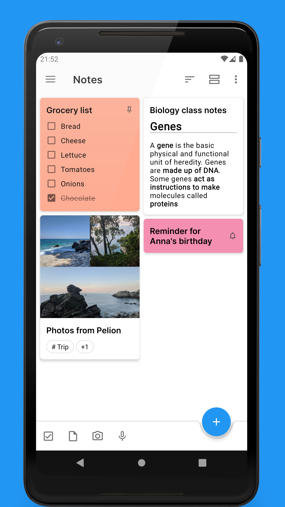
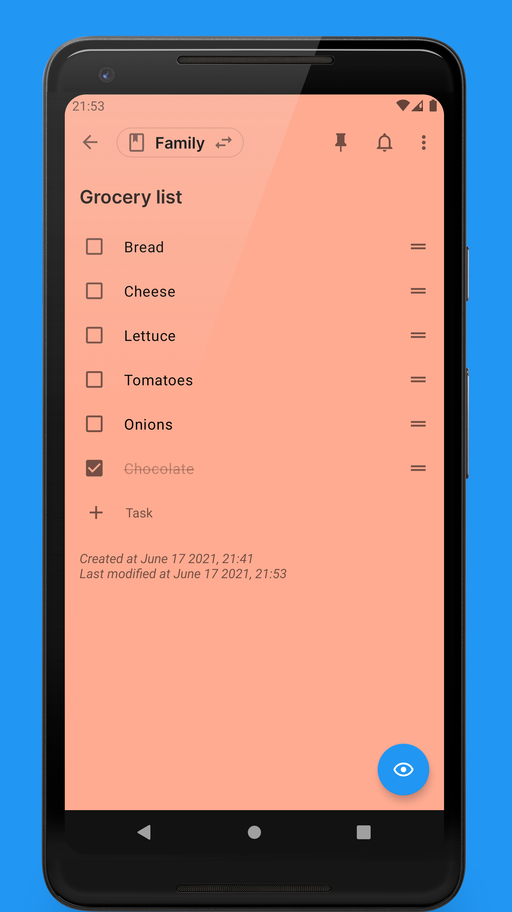

# Kitabu

[](https://github.com/Baker0o7/kitabu/actions/workflows/kitabu-apk-release.yml)
[](https://github.com/Baker0o7/kitabu/actions/workflows/android.yml)

Kitabu is a modern, open-source Android note-taking app focused on speed, privacy, and long-term usability.

It is built for real daily workflows: quick capture, markdown writing, checklists, reminders, attachments, notebooks, tags, backup, and optional sync.

## Highlights

- Markdown note editor with preview support
- Checklist and task list notes
- Notebooks and tags for organization
- Pin, archive, hide, and search notes
- Reminder support for important notes
- File attachments (including audio recordings)
- Local-first backup and restore
- Sync options:
  - File-system sync (local/cloud folders as markdown files)
  - Nextcloud sync (experimental)
- Light/Dark modes with multiple color themes
- Per-note encryption toggle in editor

## Tech Stack

- Kotlin + Android View system
- Room (local database)
- DataStore + encrypted shared preferences
- Koin (dependency injection)
- WorkManager (background tasks)
- GitHub Actions (CI/CD and APK publishing)

## Build Locally

Prerequisites:

- Android Studio (latest stable recommended)
- JDK 21
- Android SDK / Build Tools configured

Build debug APK:

```bash
./gradlew assembleDebug
```

Output:

- `app/build/outputs/apk/debug/app-debug.apk`

Build release APK (with signing params):

```bash
./gradlew assembleRelease \
  -Pkeystore=keystore.jks \
  -Pstorepass=*** \
  -Pkeypass=*** \
  -Pkeyalias=***
```

## Release APK (GitHub Actions)

Kitabu uses `.github/workflows/kitabu-apk-release.yml` to build and publish APK releases.

Release flow:

1. Push a tag in format `v*` (example: `v1.0.10`), or
2. Trigger `Kitabu APK Release` manually via Actions

After completion:

- Release page: `https://github.com/Baker0o7/kitabu/releases`
- APK asset format: `kitabu-<version>-debug.apk`

## App Screenshots

<p>
  
  
  
  
</p>
